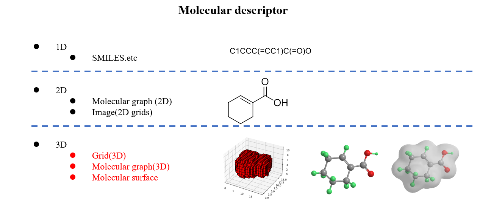

#  👏Geometry Deep Learning for Drug Discovery and Life Science
<!--  -->

💡related to  **Geometric Deep Learning** for  **Drug discovery** and **Life Science**.

**🔔Updating ...**  
## Recommendations and references

**Generative AI and Deep Learning for molecular/drug design**   
https://github.com/AspirinCode/papers-for-molecular-design-using-DL

**List of papers about Proteins Design using Deep Learning**  
https://github.com/Peldom/papers_for_protein_design_using_DL

## Menu

- [ Geometry Deep Learning for Drug Discovery and Life Science](#geometry-deep-learning-for-drug-discovery-and-life-science)
  - [Recommendations and references](#recommendations-and-references)
  - [Menu](#menu)
  - [Reviews](#reviews)
  - [Datasets and Benchmarks](#datasets-and-benchmarks)
    - [Datasets](#datasets)
    - [Benchmarks](#benchmarks)
  - [Molecular property prediction](#molecular-property-prediction)
  - [Intermolecular interaction](#intermolecular-interaction)
    - [Binding site prediction](#binding-site-prediction)
    - [Binding affinity prediction](#binding-affinity-prediction)
  - [Molecular design](#molecular-design)
    - [Ligand-based drug design](#ligand-based-drug-design)
    - [Structure-based drug design](#structure-based-drug-design)
    - [Macromolecular design](#macromolecular-design)
  - [Molecular conformation generation](#molecular-conformation-generation)
    - [Molecular-based conformation generation](#molecular-based-conformation-generation)
    - [Complex-based conformation generation](#complex-based-conformation-generation)
    - [Protein-based conformation generation](#protein-based-conformation-generation)
  - [Molecular 3D pretraining](#molecular-3d-pretraining)

## Reviews

* **A Systematic Survey of Chemical Pre-trained Models** [IJCAI 2023]   
[[Paper]](https://arxiv.org/abs/2210.16484) 

* **Structure-based drug design with geometric deep learning**[2023]  
[[Paper]](https://doi.org/10.1016/j.sbi.2023.102548)

* **MolGenSurvey: A Systematic Survey in Machine Learning Models for Molecule Design**[2022]  
[[Paper]](https://arxiv.org/abs/2203.14500)

* **Geometrically Equivariant Graph Neural Networks: A Survey**[2022]  
[[Paper]](https://arxiv.org/abs/2202.07230)

* **Geometric Deep Learning: Grids, Groups, Graphs, Geodesics, and Gauges**[2021]  
[[Paper]](https://arxiv.org/abs/2104.13478)

* **Geometric deep learning on molecular representations**[2021]  
[[Paper]](https://arxiv.org/abs/2107.12375)

## Datasets and Benchmarks

### Datasets

**QM dataset**

http://quantum-machine.org/datasets/

**Qmugs**

https://www.nature.com/articles/s41597-022-01390-7

**GEOM**

https://www.nature.com/articles/s41597-022-01288-4

**OC20**

https://github.com/Open-Catalyst-Project/ocp/blob/main/DATASET.md

**PDBBIND**

http://pdbbind.org.cn/ 

**DIPS**

https://github.com/drorlab/DIPS

**PCQM4Mv2**

https://ogb.stanford.edu/docs/lsc/pcqm4mv2/

### Benchmarks

**Leaderboard for PCQM4Mv2**

https://ogb.stanford.edu/docs/lsc/leaderboards/#pcqm4mv2

## Molecular property prediction
* **Uncertainty Estimation for Molecules: Desiderata and Methods** [ICML 2023]   
Tom Wollschläger, Nicholas Gao, Bertrand Charpentier, Mohamed Amine Ketata, Stephan Günnemann.  
[Paper](https://openreview.net/forum?id=DjwMRloMCO)  

* **Quantum 3D Graph Learning with Applications to Molecule Embedding** [ICML 2023]   
Ge Yan, Huaijin Wu, Junchi Yan.  
[Paper](https://openreview.net/pdf?id=mLOWz0e1Yq)

* **Geometry-Complete Perceptron Networks for 3D Molecular Graphs** [AAAI 2023]   
Alex Morehead, Jianlin Cheng.  
[Paper](https://arxiv.org/abs/2211.02504) | [code](https://github.com/BioinfoMachineLearning/GCPNet) 

* **Molformer: Motif-based Transformer on 3D Heterogeneous Molecular Graphs** [AAAI 2023]   
Fang Wu, Dragomir Radev, Stan Z. Li.  
[Paper](https://arxiv.org/abs/2110.01191) | [code](https://github.com/smiles724/Molformer)  

* **ComENet: Towards Complete and Efficient Message Passing for 3D Molecular Graphs** [NeurIPS 2022]   
Limei Wang, Yi Liu, Yuchao Lin, Haoran Liu, Shuiwang Ji.  
[Paper](https://arxiv.org/abs/2206.08515) | [code](https://github.com/divelab/DIG)  

* **Recipe for a General, Powerful, Scalable Graph Transformer** [NeurIPS 2022]   
Ladislav Rampášek, Mikhail Galkin, Vijay Prakash Dwivedi, Anh Tuan Luu, Guy Wolf, Dominique Beaini.  
[Paper](https://arxiv.org/abs/2205.12454) | [code](https://github.com/rampasek/GraphGPS)  

* **GPS++: An Optimised Hybrid MPNN/Transformer for Molecular Property Prediction** [2022]   
Dominic Masters, Josef Dean, Kerstin Klaser, Zhiyi Li, Sam Maddrell-Mander, Adam Sanders, Hatem Helal, Deniz Beker, Ladislav Rampášek, Dominique Beaini.  
[Paper](https://arxiv.org/abs/2212.02229) | [code](https://github.com/graphcore/ogb-lsc-pcqm4mv2)  

* **Benchmarking Graphormer on Large-Scale Molecular Modeling Datasets** [2022]   
Yu Shi, Shuxin Zheng, Guolin Ke, Yifei Shen, Jiacheng You, Jiyan He, Shengjie Luo, Chang Liu, Di He, Tie-Yan Liu.  
[Paper](https://arxiv.org/abs/2203.04810) | [code](https://github.com/Microsoft/Graphormer)  

* **Spherical message passing for 3d graph networks** [ICLR 2022]   
Yi Liu, Limei Wang, Meng Liu, Xuan Zhang, Bora Oztekin, Shuiwang Ji.  
[Paper](https://arxiv.org/abs/2102.05013) | [code](https://github.com/divelab/DIG)    

* **TorchMD-NET: Equivariant Transformers for Neural Network based Molecular Potentials** [ICLR 2022]   
Philipp Thölke, Gianni De Fabritiis.  
[Paper](https://arxiv.org/abs/2202.02541v2) | [code](https://github.com/torchmd/torchmd-net)    

* **Equivariant Graph Mechanics Networks with Constraints** [ICLR 2022]   
Wenbing Huang, Jiaqi Han, Yu Rong, Tingyang Xu, Fuchun Sun, Junzhou Huang.  
[Paper](https://arxiv.org/abs/2203.06442v1) | [code](https://github.com/hanjq17/GMN)    

* **Geometric and Physical Quantities Improve E(3) Equivariant Message Passing** [ICLR 2022]   
Johannes Brandstetter, Rob Hesselink, Elise van der Pol, Erik J Bekkers, Max Welling.  
[Paper](https://arxiv.org/abs/2110.02905)

* **GeomGCL: Geometric Graph Contrastive Learning for Molecular Property Prediction** [AAAI 2022]   
Shuangli Li, Jingbo Zhou, Tong Xu, Dejing Dou, Hui Xiong.  
[Paper](https://arxiv.org/abs/2109.11730) | [code](https://github.com/agave233/GeomGCL)    

* **Geometric Transformer for End-to-End Molecule Properties Prediction** [IJCAI 2022]   
Yoni Choukroun, Lior Wolf.  
[Paper](https://arxiv.org/abs/2110.13721) | [code](https://github.com/yoniLc/GeometricTransformerMolecule)

* **E(3)-equivariant graph neural networks for data-efficient and accurate interatomic potentials** [Nature Communications 2021]   
Simon Batzner, Albert Musaelian, Lixin Sun, Mario Geiger, Jonathan P. Mailoa, Mordechai Kornbluth, Nicola Molinari, Tess E. Smidt, Boris Kozinsky.  
[Paper](https://doi.org/10.1038/s41467-022-29939-5) | [code](http://github.com/mir-group/nequip)    

* **Equivariant message passing for the prediction of tensorial properties and molecular spectra** [ICML 2021]   
Kristof T. Schütt, Oliver T. Unke, Michael Gastegger.  
[Paper](https://arxiv.org/abs/2102.03150v1)    

* **E (n) equivariant graph neural networks** [ICML 2021]   
Victor Garcia Satorras, Emiel Hoogeboom, Max Welling.  
[Paper](https://arxiv.org/abs/2102.09844v3) | [code](https://github.com/vgsatorras/egnn)

* **GemNet: Universal Directional Graph Neural Networks for Molecules** [ICLR 2021]   
Johannes Gasteiger, Florian Becker, Stephan Günnemann.  
[Paper](https://arxiv.org/abs/2203.02923) | [code](https://github.com/TUM-DAML/gemnet_pytorch)    

* **Spatial Graph Convolutional Networks** [ICONIP 2020]   
Tomasz Danel, Przemysław Spurek, Jacek Tabor, Marek Śmieja, Łukasz Struski, Agnieszka Słowik, Łukasz Maziarka.  
[Paper](https://arxiv.org/abs/1909.05310) | [code](https://github.com/gmum/geo-gcn)    

* **Directional Message Passing for Molecular Graphs** [ICLR 2020]   
Johannes Gasteiger, Janek Groß, Stephan Günnemann.  
[Paper](https://arxiv.org/abs/2003.03123) | [code](https://github.com/gasteigerjo/dimenet)    

* **Relevance of Rotationally Equivariant Convolutions for Predicting Molecular Properties** [2020]   
Benjamin Kurt Miller, Mario Geiger, Tess E. Smidt, Frank Noé.  
[Paper](https://arxiv.org/abs/2203.02923) | [code](https://github.com/bkmi/equivariant-benchmark)    

* **Cormorant: Covariant molecular neural networks** [NeurIPS 2019]   
Brandon Anderson, Truong-Son Hy, Risi Kondor.  
[Paper](https://arxiv.org/abs/1906.04015) | [code](https://github.com/risilab/cormorant)    

* **Tensor field networks: Rotation- and translation-equivariant neural networks for 3D point clouds** [2018]   
Nathaniel Thomas, Tess Smidt, Steven Kearnes, Lusann Yang, Li Li, Kai Kohlhoff, Patrick Riley.  
[Paper](https://arxiv.org/abs/1802.08219) | [code](https://github.com/tensorfieldnetworks/tensorfieldnetworks)       

* **SchNet: A continuous-filter convolutional neural network for modeling quantum interactions** [NeurIPS 2017]   
Kristof T. Schütt, Pieter-Jan Kindermans, Huziel E. Sauceda, Stefan Chmiela, Alexandre Tkatchenko, Klaus-Robert Müller.  
[Paper](https://arxiv.org/abs/1706.08566) | [code](https://github.com/atomistic-machine-learning/schnetpack)  
## Intermolecular interaction
### Binding site prediction 
* **ScanNet: an interpretable geometric deeplearning model for structure-based protein binding site prediction** [Nature Methods 2022]   
Tubiana, Jérôme, Schneidman-Duhovny, Dina, Wolfson, Haim J.  
[Paper](https://www.nature.com/articles/s41592-022-01490-7) | [code](https://github.com/jertubiana/ScanNet)    

* **Geometric Transformers for Protein Interface Contact Prediction** [ICLR 2022]  
Alex Morehead, Chen Chen, Jianlin Cheng.  
[Paper](https://arxiv.org/abs/2110.02423) | [code](https://github.com/BioinfoMachineLearning/DeepInteract)  

* **Fast end-to-end learning on protein surfaces** [CVPR 2021]  
Freyr Sverrisson, Jean Feydy, Bruno E Correia, Michael M Bronstein.     
[Paper](https://ieeexplore.ieee.org/document/9577686) | [code](https://github.com/FreyrS/dMaSIF)  

* **Deciphering interaction fingerprints from protein molecular surfaces using geometric deep learning** [Nature Methods 2019]  
Gainza et al.  
[Paper](https://www.nature.com/articles/s41592-019-0666-6) | [code](https://github.com/lpdi-epfl/masif)  

* **DeepSite: protein-binding site predictor using 3D-convolutional neural networks** [Bioinformatics 2017]  
Jiménez et al.  
[Paper](https://pubmed.ncbi.nlm.nih.gov/28575181/)
### Binding affinity prediction
* **Geometric Interaction Graph Neural Network for Predicting Protein-Ligand Binding Affinities from 3D Structures (GIGN).** [JPCL 2023]   
Ziduo Yang, Weihe Zhong, Qiujie Lv, Tiejun Dong, Calvin Yu-Chian Chen.  
[Paper](https://pubs.acs.org/doi/10.1021/acs.jpclett.2c03906) | [code](https://github.com/guaguabujianle/GIGN)    

* **Predicting Drug-Target Interaction Using a Novel Graph Neural Network with 3D Structure-Embedded Graph Representation** [JCIM 2019]   
Jaechang Lim, Seongok Ryu, Kyubyong Park, Yo Joong Choe, Jiyeon Ham, Woo Youn Kim.  
[Paper](https://pubs.acs.org/doi/10.1021/acs.jcim.9b00387) | [code](https://github.com/jaechanglim/GNN_DTI)    

* **Graph Convolutional Neural Networks for Predicting Drug-Target Interactions** [JCIM 2019]   
Wen Torng, Russ B. Altman.  
[Paper](https://pubs.acs.org/doi/10.1021/acs.jcim.9b00628)   

* **PIGNet: a physics-informed deep learning model toward generalized drug–target interaction predictions** [Chemical Science 2020]   
Seokhyun Moon, Wonho Zhung, Soojung Yang, Jaechang Lim, Woo Youn Kim.  
[Paper](https://pubs.rsc.org/en/content/articlelanding/2022/sc/d1sc06946b#!) | [code](https://github.com/ACE-KAIST/PIGNet)    

* **Multi-Scale Representation Learning on Proteins** [NeurIPS 2021]   
Vignesh Ram Somnath, Charlotte Bunne, Andreas Krause.  
[Paper](https://arxiv.org/abs/2204.02337) | [code](https://github.com/vsomnath/holoprot)    

* **InteractionGraphNet: A Novel and Efficient Deep Graph Representation Learning Framework for Accurate Protein-Ligand Interaction Predictions** [IMC 2021]   
Dejun Jiang, Chang-Yu Hsieh, Zhenxing Wu, Yu Kang, Jike Wang, Ercheng Wang, Ben Liao, Chao Shen, Lei Xu, Jian Wu, Dongsheng Cao, Tingjun Hou.  
[Paper](https://pubs.acs.org/doi/10.1021/acs.jmedchem.1c01830) | [code](https://github.com/zjujdj/InteractionGraphNet/tree/master)    

* **Structure-aware Interactive Graph Neural Networks for the Prediction of Protein-Ligand Binding Affinity** [SIGKDD 2021]   
Shuangli Li, Jingbo Zhou, Tong Xu, Liang Huang, Fan Wang, Haoyi Xiong, Weili Huang, Dejing Dou, Hui Xiong.  
[Paper](https://arxiv.org/abs/2107.10670)  

* **AtomNet: A Deep Convolutional Neural Network for Bioactivity Prediction in Structure-based Drug Discovery** [2021]   
Izhar Wallach, Michael Dzamba, Abraham Heifets.  
[Paper](https://arxiv.org/abs/1510.02855)

* **KDEEP: Protein-Ligand Absolute Binding Affinity Prediction via 3D-Convolutional Neural Networks** [JCIM 2018]   
José Jiménez et al.  
[Paper](https://pubs.acs.org/doi/10.1021/acs.jcim.7b00650)

## Molecular design
### Ligand-based drug design

* **MolDiff: Addressing the Atom-Bond Inconsistency Problem in 3D Molecule Diffusion Generation** [ICML 2023]   
Xingang Peng, Jiaqi Guan, qiang liu, Jianzhu Ma.  
[Paper](https://openreview.net/forum?id=gfGLMZR27W) | [code](https://github.com/pengxingang/MolDiff)  

* **Coarse-to-Fine: a Hierarchical Diffusion Model for Molecule Generation in 3D** [ICML 2023]   
Bo Qiang, Yuxuan Song, Minkai Xu, Jingjing Gong, Bowen Gao, Hao Zhou, Wei-Ying Ma, Yanyan Lan.  
[Paper](https://openreview.net/forum?id=7haEvhb25X) | [code](https://github.com/qiangbo1222/HierDiff)  

* **Geometric Latent Diffusion Models for 3D Molecule Generation** [ICML 2023]   
Minkai Xu, Alexander Powers, Ron Dror, Stefano Ermon, Jure Leskovec.  
[Paper](https://arxiv.org/abs/2305.01140) | [code](https://github.com/MinkaiXu/GeoLDM)  

* **Geometry-Complete Diffusion for 3D Molecule Generation** [ICLR 2023]   
Alex Morehead, Jianlin Cheng.  
[Paper](https://arxiv.org/abs/2302.04313) | [code](https://github.com/BioinfoMachineLearning/bio-diffusion)  

* **MDM: Molecular Diffusion Model for 3D Molecule Generation** [AAAI 2023]   
Lei Huang, Hengtong Zhang, Tingyang Xu, Ka-Chun Wong  
[Paper](https://arxiv.org/pdf/2209.05710.pdf) | [code](https://github.com/tencent-ailab/MDM)  

* **MiDi: Mixed Graph and 3D Denoising Diffusion for Molecule Generation** [ECML 2023]   
Clement Vignac, Nagham Osman, Laura Toni, Pascal Frossard  
[Paper](http://export.arxiv.org/pdf/2302.09048) | [code](https://github.com/cvignac/MiDi)  

* **MUDiff: Unified Diffusion for Complete Molecule Generation** [2023]   
Chenqing Hua, Sitao Luan, Minkai Xu, Rex Ying, Jie Fu, Stefano Ermon, Doina Precup.  
[Paper](https://arxiv.org/abs/2304.14621)  

* **SILVR: Guided Diffusion for Molecule Generation** [2023]   
Nicholas T. Runcie, Antonia S. J. S. Mey.  
[Paper](https://arxiv.org/pdf/2304.10905.pdf) | [code](https://github.com/meyresearch/SILVR)  

* **Learning Joint 2D & 3D Diffusion Models for Complete Molecule Generation** [2023]   
Nicholas T. Runcie, Antonia S. J. S. Mey.  
[Paper](https://arxiv.org/pdf/2305.12347.pdf) | [code](https://github.com/GRAPH-0/JODO)  

* **Hyperbolic Graph Diffusion Model for Molecule Generation** [2023]   
Lingfeng Wen, Xian Wei  
[Paper](https://arxiv.org/pdf/2306.07618.pdf)  

* **Shape-conditioned 3D Molecule Generation via Equivariant Diffusion Models** [2023]   
Ziqi Chen, Bo Peng, Srinivasan Parthasarathy, Xia Ning  
[Paper](https://arxiv.org/pdf/2308.11890.pdf)  

* **EC-Conf: An Ultra-fast Diffusion Model for Molecular Conformation Generation with Equivariant Consistency** [2023]   
Zhiguang Fan, Yuedong Yang, Mingyuan Xu, Hongming Chen  
[Paper](https://arxiv.org/pdf/2308.00237.pdf)  

* **Torsional Diffusion for Molecular Conformer Generation** [NeurIPS 2022]
Bowen Jing, Gabriele Corso, Jeffrey Chang, Regina Barzilay, Tommi Jaakkola  
[Paper](https://arxiv.org/pdf/2206.01729.pdf) | [code](https://github.com/gcorso/torsional-diffusion)  

* **Diffusion-based Molecule Generation with Informative Prior Bridges** [NeurIPS 2022]
Lemeng Wu, Chengyue Gong, Xingchao Liu, Mao Ye, Qiang Liu  
[Paper](https://arxiv.org/pdf/2209.00865.pdf)   

* **Equivariant Diffusion for Molecule Generation in 3D** [ICML 2022]   
Emiel Hoogeboom, Victor Garcia Satorras, Clément Vignac, Max Welling.  
[Paper](https://arxiv.org/abs/2203.17003) | [code](https://github.com/ehoogeboom/e3_diffusion_for_molecules)    

* **E(n) Equivariant Normalizing Flows** [NeurIPS 2021]   
Victor Garcia Satorras, Emiel Hoogeboom, Fabian Fuchs, Ingmar Posner, Max Welling.  
[Paper](https://arxiv.org/abs/2105.09016) | [code](https://github.com/vgsatorras/en_flows)    

* **Symmetry-Aware Actor-Critic for 3D Molecular Design** [ICLR 2021]   
Gregor N. C. Simm, Robert Pinsler, Gábor Csányi, José Miguel Hernández-Lobato.  
[Paper](https://arxiv.org/abs/2011.12747) | [code](https://github.com/gncs/molgym)    

* **Reinforcement Learning for Molecular Design Guided by Quantum Mechanics** [ICML 2020]   
Gregor N. C. Simm, Robert Pinsler, José Miguel Hernández-Lobato.  
[Paper](https://arxiv.org/abs/2002.07717) | [code](https://github.com/gncs/molgym)    

* **An Autoregressive Flow Model for 3D Molecular Geometry Generation from Scratch** [ICLR 2022]   
Youzhi Luo, Shuiwang Ji.  
[Paper](https://iclr.cc/virtual/2022/poster/7066) | [code](https://github.com/divelab/DIG)    

* **Inverse design of 3d molecular structures with conditional generative neural networks** [Nature Communications 2021]   
Niklas W. A. Gebauer, Michael Gastegger, Stefaan S. P. Hessmann, Klaus-Robert Müller, Kristof T. Schütt.  
[Paper](https://arxiv.org/abs/2109.04824) | [code](http://www.github.com/atomistic-machine-learning/cG-SchNet)    

* **3D-Scaffold: A Deep Learning Framework to Generate 3D Coordinates of Drug-like Molecules with Desired Scaffolds** [JPCB 2021]   
Rajendra P Joshi, Niklas W A Gebauer, Mridula Bontha, Mercedeh Khazaieli, Rhema M James, James B Brown, Neeraj Kumar.  
[Paper](https://pubmed.ncbi.nlm.nih.gov/34662142/) | [code](https://github.com/PNNL-CompBio/3D_Scaffold)    

* **Symmetry-adapted generation of 3d point sets for the targeted discovery of molecules** [NeurIPS 2019]   
Niklas W. A. Gebauer, Michael Gastegger, Kristof T.  
[Paper](https://arxiv.org/abs/1906.00957) | [code](www.github.com/atomistic-machine-learning/G-SchNet)    

### Structure-based drug design
* **Learning Subpocket Prototypes for Generalizable Structure-based Drug Design** [ICML 2023]   
ZAIXI ZHANG, Qi Liu.  
[Paper](https://openreview.net/forum?id=gfdK6nK8AI) | [code](https://github.com/zaixizhang/DrugGPS_ICML23)  

* **DecompDiff: Diffusion Models with Decomposed Priors for Structure-Based Drug Design** [ICML 2023]   
Jiaqi Guan, Xiangxin Zhou, Yuwei Yang, Yu Bao, Jian Peng, Jianzhu Ma, Qiang Liu, Liang Wang, Quanquan Gu.  
[Paper](https://openreview.net/forum?id=9qy9DizMlr) | [code](https://github.com/bytedance/DecompDiff)  

* **3D Equivariant Diffusion for Target-Aware Molecule Generation and Affinity Prediction** [ICLR 2023]   
Jiaqi Guan, Wesley Wei Qian, Xingang Peng, Yufeng Su, Jian Peng, Jianzhu Ma.  
[Paper](https://arxiv.org/abs/2303.03543) | [code](https://github.com/guanjq/targetdiff)

* **Functional-Group-Based Diffusion for Pocket-Specific Molecule Generation and Elaboration** [2023]   
Haitao Lin, Yufei Huang, Haotian Zhang, Lirong Wu, Siyuan Li, Zhiyuan Chen, Stan Z. Li
[Paper](https://arxiv.org/pdf/2306.13769.pdf) 
 

* **Structure-based Drug Design with Equivariant Diffusion Models** [2022]   
Arne Schneuing et al.  
[Paper](https://doi.org/10.48550/arXiv.2210.13695) | [code](https://github.com/arneschneuing/DiffSBDD)  

* **Equivariant 3D-Conditional Diffusion Models for Molecular Linker Design** [2022]   
Ilia Igashov et al.  
[Paper](https://arxiv.org/abs/2210.05274) | [code](https://github.com/igashov/DiffLinker)  

* **Fragment-Based Ligand Generation Guided By Geometric Deep Learning On Protein-Ligand Structure** [2022]   
Alexander Powers, Helen Yu, Patricia Suriana, Ron Dror.  
[Paper](https://www.semanticscholar.org/paper/Fragment-Based-Ligand-Generation-Guided-By-Deep-On-Powers-Yu/8405e5a5491d871a01c6a6ec2507a5151b437560) | [code](https://github.com/marcopodda/fragment-based-dgm)  

* **Generating 3D Molecules for Target Protein Binding** [ICML 2022]   
Meng Liu, Youzhi Luo, Kanji Uchino, Koji Maruhashi, Shuiwang Ji.  
[Paper](https://arxiv.org/abs/2204.09410) | [code](https://github.com/divelab/GraphBP)  

* **3DLinker: An E(3) Equivariant Variational Autoencoder for Molecular Linker Design** [ICML 2022]   
Yinan Huang, Xingang Peng, Jianzhu Ma, Muhan Zhang.  
[Paper](https://proceedings.mlr.press/v162/huang22g.html) | [code](https://github.com/YinanHuang/3DLinker)  

* **Structure-based de novo drug design using 3D deep generative models** [Chemical Science 2021]   
Yibo Li, Jianfeng Pei, Luhua Lai.  
[Paper](https://pubmed.ncbi.nlm.nih.gov/34760151/)  

* **A 3D generative model for structure-based drug design** [NeurIPS 2021]   
Shitong Luo, Jiaqi Guan, Jianzhu Ma, Jian Peng  
[Paper](https://arxiv.org/abs/2203.10446) | [code](https://github.com/luost26/3D-Generative-SBDD)  

* **Generating 3d molecular structures conditional on a receptor binding site with deep generative models** [Chemical Science 2021]   
Tomohide Masuda, Matthew Ragoza, David Ryan Koes.  
[Paper](https://arxiv.org/abs/2010.14442) | [code](https://github.com/mattragoza/LiGAN)   

### Macromolecular design
* **End-to-End Full-Atom Antibody Design** [ICML 2023]   
Xiangzhe Kong, Wenbing Huang, Yang Liu.  
[Paper](https://openreview.net/forum?id=zAXusLf6R8) | [code]( https://github.com/THUNLP-MT/dyMEAN)  

* **AbODE: Ab initio antibody design using conjoined ODEs** [ICML 2023]   
Yogesh Verma, Markus Heinonen, Vikas Garg.  
[Paper](https://openreview.net/forum?id=EB5unD2ojL)  

* **SE(3) diffusion model with application to protein backbone generation** [ICML 2023]   
Jason Yim, Brian L. Trippe, Valentin De Bortoli, Emile Mathieu, Arnaud Doucet, Regina Barzilay, Tommi S. Jaakkola.  
[Paper](https://openreview.net/forum?id=m8OUBymxwv) | [code]( https://github.com/jasonkyuyim/se3_diffusion)  

* **Generating Novel, Designable, and Diverse Protein Structures by Equivariantly Diffusing Oriented Residue Clouds** [ICML 2023]   
Yeqing Lin, Mohammed AlQuraishi.  
[Paper](https://openreview.net/forum?id=4Kw5hKY8u8) | [code]( https://github.com/aqlaboratory/genie)  

* **Chemically Transferable Generative Backmapping of Coarse-Grained Proteins** [ICML 2023]   
Soojung Yang, Rafael Gomez-Bombarelli.  
[Paper](https://openreview.net/forum?id=7DnvWyVkUo) | [code](https://github.com/learningmatter-mit/GenZProt)  

* **Cross-Gate MLP with Protein Complex Invariant Embedding is A One-Shot Antibody Designer** [2023]   
Cheng Tan, Zhangyang Gao, Stan Z. Li.  
[Paper](https://arxiv.org/abs/2305.09480)

* **End-to-End Full-Atom Antibody Design** [ICML 2023]   
Xiangzhe Kong, Wenbing Huang, Yang Liu.  
[Paper](https://arxiv.org/abs/2302.00203) | [code](https://github.com/THUNLP-MT/dyMEAN)

* **Conditional Antibody Design as 3D Equivariant Graph Translation** [ICLR 2023]   
Xiangzhe Kong, Wenbing Huang, Yang Liu.  
[Paper](https://arxiv.org/abs/2208.06073) | [code](https://github.com/THUNLP-MT/MEAN) 

* **Antigen-Specific Antibody Design and Optimization with Diffusion-Based Generative Models** [NIPS 2022]   
Shitong Luo, Yufeng Su, Xingang Peng, Sheng Wang, Jian Peng, Jianzhu Ma.  
[Paper](https://papers.nips.cc/paper_files/paper/2022/file/3fa7d76a0dc1179f1e98d1bc62403756-Paper-Conference.pdf) | [code](https://github.com/luost26/diffab) 

* **Protein Sequence and Structure Co-Design with Equivariant Translation** [ICLR 2023]   
Chence Shi, Chuanrui Wang, Jiarui Lu, Bozitao Zhong, Jian Tang.  
[Paper](https://arxiv.org/abs/2210.087613)

* **Iterative Refinement Graph Neural Network for Antibody Sequence-Structure Co-design** [ICLR 2022 spotlight]  
Wengong Jin, Jeremy Wohlwend, Regina Barzilay, Tommi Jaakkola.  
[Paper](https://arxiv.org/abs/2110.04624) | [code](https://github.com/wengong-jin/RefineGNN) 
## Molecular conformation generation
### Molecular-based conformation generation
* **GeoDiff:A Geometric Diffusion Model for Molecular Conformation Generation** [ICLR 2022]   
Minkai Xu, Lantao Yu, Yang Song, Chence Shi, Stefano Ermon, Jian Tang.  
[Paper](https://arxiv.org/abs/2203.02923) | [code](https://github.com/MinkaiXu/GeoDiff)    

* **Learning Neural Generative Dynamics for Molecular Conformation Generation** [ICLR 2021]   
Minkai Xu, Shitong Luo, Yoshua Bengio, Jian Peng, Jian Tang.  
[Paper](https://arxiv.org/abs/2102.10240) | [code](https://github.com/MinkaiXu/CGCF-ConfGen)    

* **An End-to-End Framework for Molecular Conformation Generation via Bilevel Programming** [ICML 2021]   
Minkai Xu, Wujie Wang, Shitong Luo, Chence Shi, Yoshua Bengio, Rafael Gomez-Bombarelli, Jian Tang.  
[Paper](https://arxiv.org/abs/2105.07246) | [code](https://github.com/MinkaiXu/ConfVAE-ICML21)    

* **A Generative Model for Molecular Distance Geometry** [ICML 2020]   
Gregor N. C. Simm, José Miguel Hernández-Lobato.  
[Paper](https://arxiv.org/abs/1909.11459) | [code](https://github.com/gncs/graphdg)    

* **Learning Gradient Fields for Molecular Conformation Generation** [ICML 2021]   
Chence Shi, Shitong Luo, Minkai Xu, Jian Tang.  
[Paper](https://arxiv.org/abs/2105.03902) | [code](https://github.com/DeepGraphLearning/ConfGF)    

* **GeoMol: Torsional Geometric Generation of Molecular 3D Conformer Ensembles** [NeurIPS 2021]   
Octavian-Eugen Ganea, Lagnajit Pattanaik, Connor W. Coley, Regina Barzilay, Klavs F. Jensen, William H. Green, Tommi S. Jaakkola.  
[Paper](https://arxiv.org/abs/2106.07802) | [code](https://github.com/PattanaikL/GeoMol)    

* **Predicting Molecular Conformation via Dynamic Graph Score Matching** [NeurIPS 2021]   
Shitong Luo, Chence Shi, Minkai Xu, Jian Tang.  
[Paper](https://www.nature.com/articles/s41592-022-01490-7)

* **Direct Molecular Conformation Generation** [2022]   
Jinhua Zhu, Yingce Xia, Chang Liu, Lijun Wu, Shufang Xie, Yusong Wang, Tong Wang, Tao Qin, Wengang Zhou, Houqiang Li, Haiguang Liu, Tie-Yan Liu.  
[Paper](https://arxiv.org/abs/2202.01356) | [code](https://github.com/DirectMolecularConfGen/DMCG)    

* **Molecular Geometry Prediction using a Deep Generative Graph Neural Network** [Scientific Reports 2019]   
Elman Mansimov, Omar Mahmood, Seokho Kang, Kyunghyun Cho.  
[Paper](https://arxiv.org/abs/1904.00314) | [code](https://github.com/nyu-dl/dl4chem-geometry)    
### Complex-based conformation generation
* **DiffDock: Diffusion Steps, Twists, and Turns for Molecular Docking** [2022]   
Gabriele Corso, Hannes Stärk, Bowen Jing, Regina Barzilay, Tommi S Jaakkola.  
[Paper](https://doi.org/10.48550/arXiv.2210.01776) 

* **TANKBind: Trigonometry-Aware Neural NetworKs for Drug-Protein Binding Structure Prediction** [NeurIPS 2022]   
Wei Lu, Qifeng Wu, Jixian Zhang, Jiahua Rao, Chengtao Li, Shuangjia Zheng.  
[Paper](https://www.biorxiv.org/content/10.1101/2022.06.06.495043v1) | [code](https://github.com/luwei0917/TankBind )  

* **EquiBind: Geometric Deep Learning for Drug Binding Structure Prediction** [ICML 2022]   
Hannes Stärk, Octavian-Eugen Ganea, Lagnajit Pattanaik, Regina Barzilay, T Jaakkola.  
[Paper](https://arxiv.org/abs/2202.05146) | [code](https://github.com/HannesStark/EquiBind)  

* **A geometric deep learning approach to predict binding conformations of bioactive molecules** [JCIM 2021]   
Arne Schneuing et al.  
[Paper](https://www.nature.com/articles/s42256-021-00409-9) | [code](https://github.com/OptiMaL-PSE-Lab/DeepDock)  

* **Independent SE(3)-Equivariant Models for End-to-End Rigid Protein Docking** [ICLR 2022]   
Octavian-Eugen Ganea, Xinyuan Huang, Charlotte Bunne, Yatao Bian, Regina Barzilay, Tommi Jaakkola, Andreas Krause.  
[Paper](https://arxiv.org/abs/2111.07786) | [code](https://github.com/octavian-ganea/equidock_public)  

* **DeepBSP—a machine learning method for accurate prediction of protein–ligand docking structures** [2021]   
Jingxiao Bao, Xiao He,* and John Z. H. Zhang*.  
[Paper](https://pubmed.ncbi.nlm.nih.gov/33979150/) | [code](https://github.com/BaoJingxiao/DeepBSP)  

### Protein-based conformation generation
* **EigenFold: Generative Protein Structure Prediction with Diffusion Models**  [ICLR 2023 workshop]  
Bowen Jing, Ezra Erives, Peter Pao-Huang, Gabriele Corso, Bonnie Berger, Tommi Jaakkola.  
[Paper](https://arxiv.org/abs/2304.02198) | [code](https://github.com/bjing2016/EigenFold)  

* **Highly accurate protein structure prediction with AlphaFold** [Nature]  
John et al.  
[Paper](https://www.nature.com/articles/s41586-021-03819-2) | [code](https://github.com/deepmind/alphafold)  

* **Learning Hierarchical Protein Representations via Complete 3D Graph Networks** [ICLR 2023]   
Limei Wang, Haoran Liu, Yi Liu, Jerry Kurtin, Shuiwang Ji.  
[Paper](https://openreview.net/pdf?id=9X-hgLDLYkQ) | [code](https://github.com/divelab/DIG)  

* **ScanNet: an interpretable geometric deeplearning model for structure-based protein binding site prediction** [Nature communications 2021]   
Nicolas Renaud, Cunliang Geng, Sonja Georgievska, Francesco Ambrosetti, Lars Ridder, Dario F. Marzella, Manon F. Réau, Alexandre M. J. J. Bonvin & Li C. Xue .  
[Paper](https://www.nature.com/articles/s41467-021-27396-0) | [code](https://github.com/DeepRank/deeprank)  

* **Geometric deep learning of RNA structure** [Science 2021]   
RAPHAEL J. L. TOWNSHEND, STEPHAN EISMANN, ANDREW M. WATKINS, RAMYA RANGAN, MARIA KARELINA, RHIJU DAS, AND RON O. DROR.  
[Paper](https://www.science.org/doi/10.1126/science.abe5650)

* **Intrinsic-Extrinsic Convolution and Pooling for Learning on 3D Protein Structures** [ICLR 2021]   
Pedro Hermosilla, Marco Schäfer, Matěj Lang, Gloria Fackelmann, Pere Pau Vázquez, Barbora Kozlíková, Michael Krone, Tobias Ritschel, Timo Ropinski.  
[Paper](https://arxiv.org/abs/2007.06252) | [code](https://github.com/phermosilla/IEConv_proteins)  

* **Learning from Protein Structure with Geometric Vector Perceptrons** [ICLR 2021]   
Bowen Jing, Stephan Eismann, Patricia Suriana, Raphael J.L. Townshend, Ron Dror.  
[Paper](https://arxiv.org/abs/2009.01411) | [code](https://github.com/drorlab/gvp)  

* **SpookyNet: Learning force fields with electronic degrees of freedom and nonlocal effects** [Nature communications 2021]   
Oliver T. Unke, Stefan Chmiela, Michael Gastegger, Kristof T. Schütt, Huziel E. Sauceda & Klaus-Robert Müller .  
[Paper](https://www.nature.com/articles/s41467-021-27504-0) | [code](https://github.com/OUnke/SpookyNet)
## Molecular 3D pretraining
* **Protein Representation Learning by Geometric Structure Pretraining** [ICLR 2023]   
Zuobai Zhang, Minghao Xu, Arian Jamasb, Vijil Chenthamarakshan, Aurelie Lozano, Payel Das, Jian Tang.  
[Paper](https://arxiv.org/abs/2203.06125) | [code](https://github.com/DeepGraphLearning/GearNet)  

* **Pre-training of Equivariant Graph Matching Networks with Conformation Flexibility for Drug Binding** [Advanced Science 2022]   
Fang Wu, Shuting Jin, Yinghui Jiang, Xurui Jin, Bowen Tang, Zhangming Niu, Xiangrong Liu, Qiang Zhang, Xiangxiang Zeng, Stan Z. Li.  
[Paper](https://arxiv.org/abs/2204.08663) | [code](https://github.com/smiles724/ProtMD)  

* **Self-Supervised Pre-training for Protein Embeddings Using Tertiary Structures** [AAAI 2022]   
Yuzhi Guo, Jiaxiang Wu, Hehuan Ma, Junzhou Huang.  
[Paper](https://ojs.aaai.org/index.php/AAAI/article/view/20636)   

* **Fractional Denoising for 3D Molecular Pre-training** [ICML 2023]
Shikun Feng, Yuyan Ni, Yanyan Lan, Zhi-Ming Ma, Weiying Ma.
[Paper](https://openreview.net/forum?id=vH6cWEqceA) | [code](https://github.com/fengshikun/Frad)

* **A Group Symmetric Stochastic Differential Equation Model for Molecule Multi-modal Pretraining** [ICML 2023]
Shengchao Liu, weitao Du, Zhi-Ming Ma, Hongyu Guo, Jian Tang  
[Paper](https://openreview.net/forum?id=mPEVwu50th) | [code](https://github.com/chao1224/MoleculeSDE)

* **Mole-BERT: Rethinking Pre-training Graph Neural Networks for Molecules** [ICLR 2023]
Jun Xia, Chengshuai Zhao, Bozhen Hu, Zhangyang Gao, Cheng Tan, Yue Liu, Siyuan Li, Stan Z. Li.  
[Paper](https://openreview.net/forum?id=jevY-DtiZTR) | [code](https://github.com/junxia97/Mole-BERT)

* **LagNet: Deep Lagrangian Mechanics for Plug-and-Play Molecular Representation Learning** [AAAI 2023]   
Chunyan Li, JunfengYao, Jinsong Su, Zhaoyang Liu, Xiangxiang Zeng, Chenxi Huang.  
[Paper](https://underline.io/lecture/67859-lagnet-deep-lagrangian-mechanics-for-plug-and-play-molecular-representation-learning) 

* **Transformer-M: One Transformer Can Understand Both 2D & 3D Molecular Data** [ICLR 2023]   
Shengjie Luo, Tianlang Chen, Yixian Xu, Shuxin Zheng, Tie-Yan Liu, Liwei Wang, Di He.  
[Paper](https://arxiv.org/abs/2210.01765) | [code](https://github.com/lsj2408/Transformer-M)  

* **Uni-Mol: A Universal 3D Molecular Representation Learning Framework** [ICLR 2023]   
Gengmo Zhou, Zhifeng Gao, Qiankun Ding, Hang Zheng, Hongteng Xu, Zhewei Wei, Linfeng Zhang, Guolin Ke.  
[Paper](https://openreview.net/forum?id=6K2RM6wVqKu) | [code](https://github.com/dptech-corp/Uni-Mol)  

* **Molecular Geometry Pretraining with SE(3)-Invariant Denoising Distance Matching** [ICLR 2023]   
Shengchao Liu, Hongyu Guo, Jian Tang.  
[Paper](https://arxiv.org/abs/2206.13602) | [code](https://github.com/chao1224/GeoSSL)  

* **Pre-training via Denoising for Molecular Property Prediction** [ICLR 2023]   
Sheheryar Zaidi, Michael Schaarschmidt, James Martens, Hyunjik Kim, Yee Whye Teh, Alvaro Sanchez-Gonzalez, Peter Battaglia, Razvan Pascanu, Jonathan Godwin.  
[Paper](https://arxiv.org/abs/2206.00133) | [code](https://github.com/shehzaidi/pre-training-via-denoising)   

* **Energy-Motivated Equivariant Pretraining for 3D Molecular Graphs** [AAAI 2023]   
Rui Jiao, Jiaqi Han, Wenbing Huang, Yu Rong, Yang Liu.  
[Paper](https://arxiv.org/abs/2207.08824) | [code](https://github.com/jiaor17/3D-EMGP)  

* **Zero-Shot 3D Drug Design by Sketching and Generating** [NeurIPS 2022]   
Siyu Long, Yi Zhou, Xinyu Dai, Hao Zhou.  
[Paper](https://arxiv.org/abs/2209.13865v2) | [code](https://github.com/longlongman/DESERT)  

* **Pre-training Molecular Graph Representation with 3D Geometry** [ICLR 2022]   
Shengchao Liu, Hanchen Wang, Weiyang Liu, Joan Lasenby, Hongyu Guo, Jian Tang.  
[Paper](https://arxiv.org/abs/2110.07728) | [code](https://github.com/chao1224/GraphMVP)  

* **Simple GNN Regularisation for 3D Molecular Property Prediction & Beyond** [ICLR 2022]   
Jonathan Godwin, Michael Schaarschmidt, Alexander Gaunt, Alvaro Sanchez-Gonzalez, Yulia Rubanova, Petar Veličković, James Kirkpatrick, Peter Battaglia.  
[Paper](https://arxiv.org/abs/2106.07971)

* **Geometry-enhanced molecular representation learning for property prediction** [NMI 2022]   
Xiaomin Fang, Lihang Liu, Jieqiong Lei, Donglong He, Shanzhuo Zhang, Jingbo Zhou, Fan Wang, Hua Wu & Haifeng Wang.  
[Paper](https://www.nature.com/articles/s42256-021-00438-4) | [code](https://github.com/PaddlePaddle/PaddleHelix/tree/dev/apps/pretrained_compound/ChemRL/GEM)  

* **3D Infomax improves GNNs for Molecular Property Prediction** [ICML 2022]   
Hannes Stärk, Dominique Beaini, Gabriele Corso, Prudencio Tossou, Christian Dallago, Stephan Günnemann, Pietro Liò.  
[Paper](https://arxiv.org/abs/2110.04126) | [code](https://github.com/HannesStark/3DInfomax)  

* **Unified 2D and 3D Pre-Training of Molecular Representations** [KDD 2022]   
Jinhua Zhu, Yingce Xia, Lijun Wu, Shufang Xie, Tao Qin, Wengang Zhou, Houqiang Li, Tie-Yan Liu.  
[Paper](https://arxiv.org/abs/2207.08806) | [code](https://github.com/teslacool/UnifiedMolPretrain)  

* **HamNet: Conformation-Guided Molecular Representation with Hamiltonian Neural Networks** [ICLR 2021]   
Ziyao Li, Shuwen Yang, Guojie Song, Lingsheng Cai.  
[Paper](https://arxiv.org/abs/2105.03688)  

